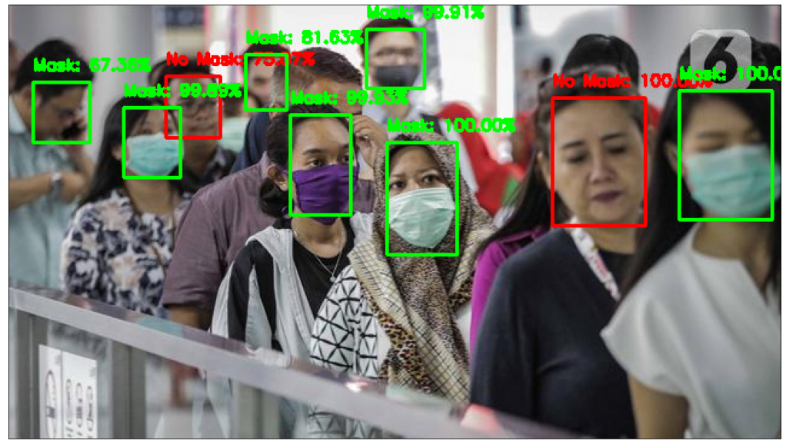
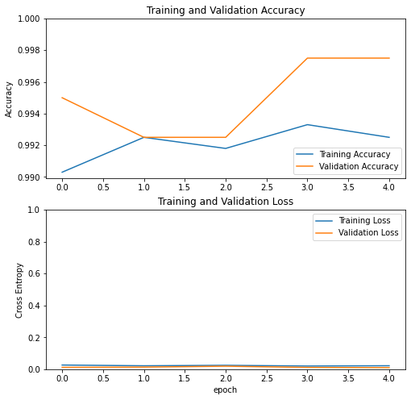

<h1 align="center">Face Mask Detection</h1>

## Intro

This code is inspired by my friend at Bangkit Academy LED by Google that want to help government to separate people who wear a mask or not. 

Consider that I train this model by using pre-trained model MobileNetV2 which you can read more here about MobileNetV2: [Documentation](https://www.tensorflow.org/api_docs/python/tf/keras/applications/MobileNetV2), [Architecture](https://tfhub.dev/s?network-architecture=mobilenet-v2), [Dataset](https://tfhub.dev/s?dataset=imagenet-ilsvrc-2012-cls).

You can found other demo's videos by following this directory   `./DEMO` or you can click this image bellow:

<p align="center">
  
</p>

## Dependencies

- Python 3
- tensorflow 2.1
- openCV
- matplotlib

## Dataset 
I load the data using `Kaggle API` which you can found here [Face Mask ~12K Images Dataset](https://www.kaggle.com/ashishjangra27/face-mask-12k-images-dataset). The size for all data is 329MB, with 10.000 images for training, 800 images for validation, and 992 images for testing.

### How To Run

Step to run this file is depend on what you're needed. 

1. If you just want to use face mask classification, you can download this python file `Predicting_Face_Mask.py` or by following this directory to read the notebook file to make you eazier to understand line by line of code `./IPYNB_FILE/Predicting_Face_Mask.ipynb`. After download it, you have to follow this following steps:
- Download weight in this directory to face mask classification model `MODEL/model.05-0.00.h5`
- Run this command in your terminal which your python file exist
    ```
    python python_file_name.py --image directory_of_your_photos/photos_name.jpg
    ```
- And you'll get this result 
    ```
    prediction : name_of_class xx.xx%
    ```

2. If you want to build face mask detector based on image, you need to download this python file `DETECT_FACE_MASK.py` or you can follow this directory to read the notebook file `IPYNB_FILE\DETECT_FACE_MASK.ipynb`. These are steps that you must be followed.
- Download weight in this directory to face mask classification model `MODEL/model.05-0.00.h5`.
- Download this caffee model in this directory `CAFFEE/deploy.prototxt` and `CAFFEE/res10_300x300_ssd_iter_140000.caffemodel`.
- Run this command in your terminal which your python file exist
    ```
    python python_file_name.py --image directory_of_your_photos/photos_name.jpg
    ```
- More or less, you'll get this result 



2. Last but not least, if you want to detect whether people wearing mask or not with video based, you can download this python file `video_face_mask_detection.py` I'm not creating a notebook file, because the latency when I load the videos on the colab is very high. These are steps that you must be followed.
- Download weight in this directory to face mask classification model `MODEL/model.05-0.00.h5`.
- Download this caffee model in this directory `CAFFEE/deploy.prototxt` and `CAFFEE/res10_300x300_ssd_iter_140000.caffemodel`.
- Run this command in your terminal which your python file exist
    ```
    python python_file_name.py --image directory_of_your_videos/videos_name.mp4
    ```
- You'll get the result same with my DEMO file above.


## Design the net

Skip this if you are working with one of the original configurations since they are already there. Otherwise, see the following example:

```python
...

[Untrainable MobileNetV2 Layer]
[AveragePooling2D]
    -> pool_size=(7, 7)
[Flatten]
[Dense]
    -> 512 neuron
    -> activation="relu"
[Dropout]
    -> 0.5
[Dense]
    -> 128 neuron
    -> activation="relu"
[Dropout]
    -> 0.5
[Dense]
    -> 2 neuron
    -> activation="softmax"

...
```

## Training the model

In the training model, these are what I got :
- Total params: 2,979,778
- Trainable params: 721,794
- Non-trainable params: 2,257,984
Since we're not trying to retrain mobileNetV2 layer it's affected to the total of Non-trainable params. And the rest params is from my layer that I training.

## Accuracy of the model 
I got this accuracy when I train my model :


I've got `99,75%` accuracy for data validation, it's pretty good since the model can predict a new data almost all of them. 

## Android deployment
I save tflite model to deploy my model on Android. Next, I try to deploy this model on Android whether it's Live Stream or upload a photos and it will detect people who wearing a mask.